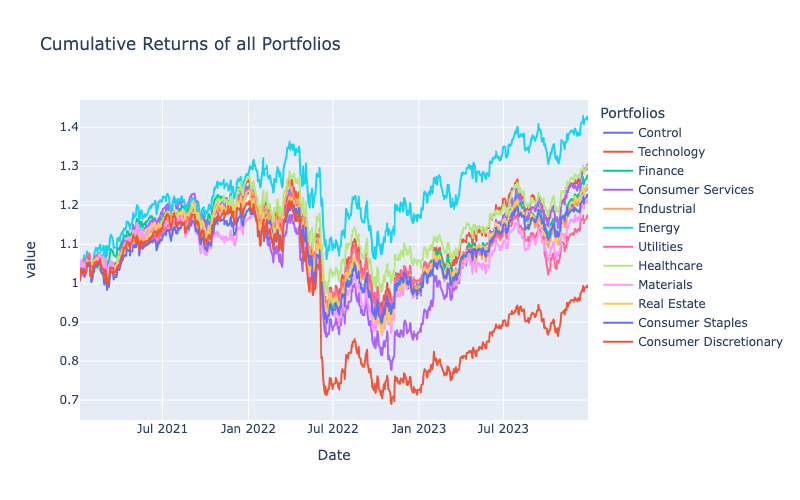
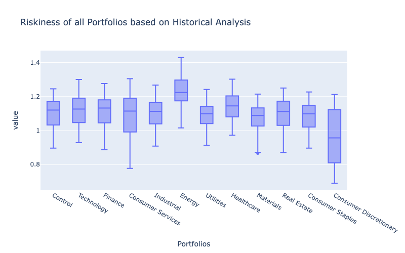

# Qualitative Analysis of Sector-Heavy Portfolios
## Project Overview
This project strives to explain the potential returns for a prospective investor. The project does this by utilizing simulation data based on historical price data provided in the Pandas dataframe.

Important note: Due to a majority of visualizations being created with Plotly, visualizations may not show in the Github preview of the main_notebook.ipnyb and the visualizations_notebook. Please clone and run notebooks in Jupyter Lab to see visualizations. 
## Project Description
    Embark on an exploration of data analysis, seamlessly integrating the use of data visualization, extraction, historical analysis, risk assessment, and adeptly navigating the nuanced landscape of a Monte Carlo simulation. This project entails a thorough examination of portfolios, each endowed with a $20,000 investment spanning a 3 year temporal horizon, as well as securing a heavily weighted stock that we have chosen to represent its respective sector. The ensuing qualitative analysis and comparative analysis yield profound insights into the dynamics of an investment performance.
## Important Files
• main_notebook.pynb - contains all data analysis (inclusing visualizations)

• visualizations_notebook.ipynb - contains a single line of code that ca be ran to only see
visualizations created in‘main_notebook.ipynb’

• MCForecastTools.py - contains script for our Monte Carlo Simulation. MCForecastTools.py from
Module 5 assignment was used and modified for this assignment.

• .gitignore - contains API Keys

• data_collection.py - was created in class on Day 1 of this project

• Images - This directory contains all visualizations created as .png files
## Features
 • MCSimulation Class: A Python class for Monte Carlo Simulation of portfolio cumulative returns.

 • Cumulative Return Calculation: Calculate cumulative returns based on the provided portfolio
    data.

 • Simulation Plotting: Plot the simulated trajectories of cumulative portfolio returns.

 • Distribution Plotting: Visualize the distribution of final cumulative returns across multiple
simulations.

 • Summary Statistics: Obtain summary statistics and 95% confidence intervals for the simulated
    cumulative returns.
## Questions asked
• Which Portfolio will have the highest potential gain?

• Which Portfolios will contend for the highest potential gains?

• After consulting our data, which stock/portfolio was the most volatile?

• Is there an evident outlier in the data, if so what caused this outlier?

• What difficulties could be/were encountered during the data analysis process?
## Analysis
### API Data Extraction
API Data from the pertaining time period (1-1-2021 : 1-1-24) was extracted and cleaned. Proceeding this, the remaining data is to be put into a single dataframe.
### Historical Analysis
Utilizing the Pandas and Numpy functions, set weights were incorporated for each of the 11 selected stocks. Then, using the provided function was able to calculate: Daily, Cumulative, and Historical Value. All with an initial investment of $20,000.

### Risk Analysis
Using Pandas, and Numpy we were able to calculate the standard deviation for each portfolio, as well as a box plot visualizing the risk.

### Monte Carlo Simulation
Monte Carlo simulations were performed on each prospective portfolio, in order to calculate 5 years worth of cumulative returns. Visualizations where then able to be created, showing the potential funds of each portfolio with an initial investment of $20,000.

## Findings and Problems Faced
• Energy maintained superior performance when compared to historical analysis.

• Preceeding Monte Carlo simulations with provided data, the consumer services portfolio
competed fiercly with the eventual "winner" of the analysis, Energy.

• Although consumer discretionsary was the most volatile, it did not yield a healthy risk
ratio.

• Whilst running our quantitative anaylysis we noticed an outlier around the summer months of
2022. As we delved further into our findings, we found that after educating ourselves on the
economic conditions at the specific time (Summer of 2002) that the outlier was skewed due to the fact that Amazon issued a 20:1 stock split, which affected each portfolio negatively.

• During our data analysis, we found trouble when attempting to create a single box plot
    visualization with hvPlot that expressed similar risk values.
### Credit and Contributors
    Nick Wuebben
    Github: Nawuebb
    Jordan Romnes
    Github: jromnes

